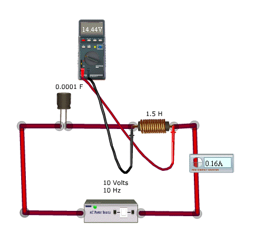

## Theory 

<h2>Series LC Circuit</h2>

  

 

  The schematic diagram below shows an ideal series circuit containing inductance and capacitance but no resistance. As with the RC and RL circuits we have already examined, capacitor <strong>C</strong> and inductor <strong>L</strong> form a voltage divider across the voltage source. In this case, however, we have no resistance to provide an absolute limit on the current that can flow through the circuit — we have only <em>XC</em> and <em>XL</em>.

  For this example, we'll assume a frequency of <strong>10 Hz</strong>. We'll also set <strong>L = 1.5 H</strong> and <strong>C = 0.0001 F</strong>. The source voltage is <strong>10 Vrms</strong>.

  When we measure the AC voltages across L and C, we find <strong>VL = 14.44 V</strong> and <strong>VC = 24.44 V</strong>. Yet our source voltage is still just 10 V. What's going on here? How can we get 38.88 V across two components in series across a 10 V source?

  The answer becomes clear when we look at the voltage vectors in this circuit.

  Since this is a series circuit, the current is the same throughout. With no circuit resistance, there is no resistive voltage, so we simply show the current vector in red, at the reference phase angle of 0°.

  We know that voltage leads current in an inductance, so we show <em>VL</em> at a phase angle of +90°. We also know that voltage lags current in a capacitance, so we show <em>VC</em> at -90°. This gives us a clue as to how both <em>VL</em> and <em>VC</em> can be greater than the source voltage: they are in opposition and partially cancel each other out. It is the difference between these two voltages that matches the source voltage, and sure enough, <strong>24.44 V − 14.44 V = 10 V</strong>.

  If <em>XL &gt; XC</em>, the combined circuit appears inductive to the source. If <em>XC &gt; XL</em>, the circuit appears capacitive. The remaining question is how to determine the lengths (magnitudes) of the two vectors for <em>VL</em> and <em>VC</em>.

  As with previous circuits, our calculations are based on Ohm's Law.

$$i_L = \frac{V_L}{X_L}$$
$$i_C = \frac{V_C}{X_C}$$
$$i = \frac{V}{Z}$$

  Since this is a series circuit, <em>iL = iC = i</em>, and we can use <strong>i</strong> as the reference value for all of our calculations. Also, since both <em>XL</em> and <em>XC</em> require us to determine the value of <strong>2πf</strong> (which equals <strong>ω</strong>, the angular frequency), let's calculate that now.

  For a frequency of <strong>1 MHz</strong>:

  <strong>ω = 2πf = 2 × π × 1,000,000 = 6,283,185 rad/s</strong>

$$\omega = 2\pi f = 6.283185 \times 10 = 62.83185$$

Now we can complete our calculations, starting with $X_L$, $X_C$, and Z:

$$X_L = \omega L= 62.831853 \times 1.5= 94.2477795\mathrm{\Omega}$$

$$X_c = \frac{1}{\omega C}= \frac{1}{62.831853 \times 0.0001}$$
$$= \frac{1}{0.0062831853}= 159.1549433\mathrm{\Omega}$$

$$Z = ((X_L - X_C)^2)^{1/2}= |X_L - X_C|$$
$$= |94.2477795 - 159.1549433|= 64.90716380\mathrm{\Omega}$$

$$i = \frac{V}{Z}= \frac{10}{64.9071638}= 0.154066199250\mathrm{A}$$
$$V_L = i \times X_L= 0.154066198776 \times 94.247775= 14.52\mathrm{V}$$

$$V_c = i \times X_c= 0.154066199250 \times 159.15495= 24.52\mathrm{V}$$

  Note that the difference between $V_L$ and $V_C$ is precisely 10 volts — the value of the voltage source. Nevertheless, the voltages across L and C each exceed the source voltage by several times. This is only possible because of the phase relationship between $V_L$ and $V_C$ : these voltages are always opposite in phase.

 

  Since the total impedance of this circuit is the difference between <em>XL</em> and <em>XC</em>, what happens if these two values are equal? There will be some frequency at which this will be the case, so we need to consider it. How will the circuit behave in this case?

<h4>When XL = XC</h4>

  We have examined one specific case of a series LC circuit and its behavior at one particular frequency. We also know that at higher frequencies <em>XL</em> will increase while <em>XC</em> decreases. At lower frequencies, of course, <em>XL</em> will decrease while <em>XC</em> increases.

  The question that begs to be asked is, how does the circuit behave at the frequency where <em>XL</em> = <em>XC</em>? Also, how can we determine what that frequency will be?

  Finding the "magic" frequency is not a problem. Since both <em>XL</em> and <em>XC</em> depend on the frequency, we simply set the two to be equal to each other and solve the resulting expression for frequency:

$$X_L = X_C$$
$$\omega L = \frac{1}{\omega C}$$
$$\omega^2 = \frac{1}{LC}$$
$$\omega = \frac{1}{\sqrt{LC}}$$
$$f = \frac{1}{2\pi\sqrt{LC}}$$

  The resonant frequency is the same with an AC voltage applied, but the continuous AC input makes up for any losses in the circuit so the oscillations never die out.

  At resonance, since <em>XL</em> = <em>XC</em>, it is also true that <em>XL</em> − <em>XC</em> = 0. Therefore, there is absolutely no reactive component to <em>Z</em> at the resonant frequency. In the absence of any resistance, current <em>i</em> rises without limit and becomes theoretically infinite. The voltage source behaves as if it were directly short-circuited.

  In reality, no circuit is completely without resistance, and the resistance present will serve to limit the current from the source. However, if the resistance is very small, the current will still be high. In some cases, a resistor is deliberately added to set a minimum impedance and maximum current at resonance.

  This can be verified using the simulator, by changing the frequency of the previous example to 13 Hz.

<h3>Applications</h3>

<strong>LC circuits</strong> are key components in many applications:

<ul>
  <li>Graphics tablets</li>
  <li>Mixers</li>
  <li>Oscillators</li>
  <li>Filters</li>
  <li>Tuners</li>
  <li>Foster-Seeley discriminator</li>
  <li>Contactless cards</li>
  <li>Electronic Article Surveillance</li>
</ul>

